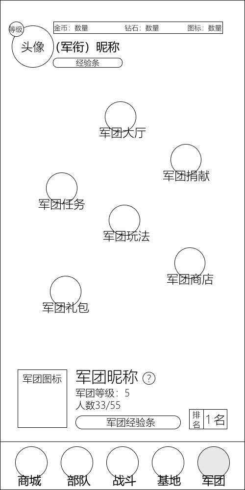

# 模块划分——军团模块

| 版本 | v1.0.0 |
|---|---|
| 日期 | 2026-07-25 |

---

## 一、模块概述

军团模块是游戏的社交核心，提供军团组建、成员互动、资源捐赠、集体任务、专属活动与贡献兑换等功能。军团 Tab 在玩家等级达到 Lv.5 后解锁。

军团面板分"未加入"与"已加入"两种状态：未加入时显示军团列表与创建入口；已加入时显示军团功能入口聚合页与军团信息卡。当前原型展示的是"已加入"状态。

本模块包含以下界面：

| 界面 | 触发场景 | 对应原型 |
|---|---|---|
| 军团面板（已加入） | 底部导航点击"军团"，且已加入军团 | `军团面板（已加入）.png` |

> 军团创建 / 加入、成员管理、碎片捐赠、军团等级与奖励、军团约架等系统设计详见 [社交与军团系统](../设计文档/03_局外系统/社交与军团系统.md)。

---

## 二、军团面板（已加入）

底部导航点击"军团"进入，已加入军团时展示功能入口聚合页与军团信息卡。

### 2.1 顶部信息区

固定头部，贯穿全部局外界面。

| 元素 | 位置 | 说明 |
|---|---|---|
| 头像框 | 左上角，圆形 | 玩家角色头像，左上角叠加等级角标 |
| 军衔与昵称 | 头像右侧 | 格式"(军衔) 昵称"，下方为经验进度条 |
| 资源栏 | 顶部横向 | 三栏式：金币 / 钻石 / 体力，点击对应图标跳转商城 |

> 顶部信息区与资源栏为全局通用组件，详见 [全局UI模块](../设计文档/05_UI与交互/全局UI模块.md) 第 1.3 节。

### 2.2 中部功能入口区

分散式布局，6 个圆形功能入口分布如下：

| 入口 | 说明 |
|---|---|
| 军团大厅 | 军团主界面，含成员列表、军团聊天、约架、管理设置 |
| 军团捐献 | 兵种碎片捐赠，发起 / 响应捐赠请求，获得军团贡献与经验 |
| 军团任务 | 军团集体日常 / 周常任务，完成发放军团贡献与经验 |
| 军团玩法 | 军团专属 PVE / PVP 集体活动 |
| 军团商店 | 使用军团贡献兑换兵种碎片 / 资源 / 将军等 |
| 军团礼包 | 军团宝箱福利领取，等级越高品质越好 |

> 军团大厅（成员列表 / 聊天 / 约架 / 设置）、军团捐献（碎片捐赠：每日 1 次请求、3 次捐赠）、军团礼包（军团宝箱：定期发放、等级提升品质）的详细规则见 [社交与军团系统](../设计文档/03_局外系统/社交与军团系统.md) 第 1.3 节。军团任务、军团玩法、军团商店为 UI 新增入口，功能定义：军团任务＝集体任务、军团玩法＝专属活动、军团商店＝贡献兑换。

### 2.3 军团信息卡

面板中下部卡片式信息区，展示当前军团状态：

| 元素 | 说明 |
|---|---|
| 军团图标 | 左侧方形图标 |
| 军团昵称 | 大字，右侧带"?"帮助图标 |
| 军团等级 | "军团等级：5" |
| 人数 | "人数 33/55"（当前 / 上限） |
| 军团经验条 | 圆角进度条，展示军团升级进度 |
| 排名 | 竖排"排名" + 大字"1名" |

> 军团等级影响人数上限与宝箱品质，军团经验由成员捐赠、约架、日常活跃贡献，详见 [社交与军团系统](../设计文档/03_局外系统/社交与军团系统.md) 第 1.3 节军团等级与奖励。

### 2.4 底部导航

5 Tab 底部固定导航，当前所在"军团"Tab 高亮。完整导航结构详见 [全局UI模块](../设计文档/05_UI与交互/全局UI模块.md) 第一章。

| 位置 | Tab | 解锁等级 |
|---|---|---|
| 最左 | 商城 | Lv.2 |
| 左二 | 部队 | Lv.1 |
| 中央 | 战斗 | Lv.1 |
| 右二 | 基地 | Lv.6 |
| 最右 | 军团（当前选中） | Lv.5 |

---

## 三、未加入状态（参考）

未加入军团时，军团 Tab 显示军团列表与创建入口（当前原型未提供该状态界面）。功能详见 [社交与军团系统](../设计文档/03_局外系统/社交与军团系统.md) 第 1.2 节：

| 元素 | 说明 |
|---|---|
| 搜索 | 按军团名称或 ID 搜索 |
| 创建 | 消耗 300 钻石创建军团，设置名称、公告、入团条件、徽章 |
| 推荐军团 | 系统推荐未满员军团，展示名称、等级、人数、战力要求 |
| 申请加入 | 满足战力要求可申请，军团长 / 官员审批后加入 |

---

## 四、关联模块

| 关联模块 | 关系 | 参考文档 |
|---|---|---|
| 全局UI模块 | 顶部资源栏、底部 5 Tab 导航、军团 Tab 解锁 | [全局UI模块](../设计文档/05_UI与交互/全局UI模块.md) |
| 社交与军团系统 | 军团创建 / 加入、成员管理、碎片捐赠、约架、等级与奖励 | [社交与军团系统](../设计文档/03_局外系统/社交与军团系统.md) |
| PVP 模式 | 军团约架实时 PVP 战斗机制 | [PVP 模式设计](../设计文档/04_游戏模式/PVP模式设计.md) |
| 经济与资源系统 | 军团贡献 / 经验的经济定位 | [经济与资源系统](../设计文档/03_局外系统/经济与资源系统.md) |
