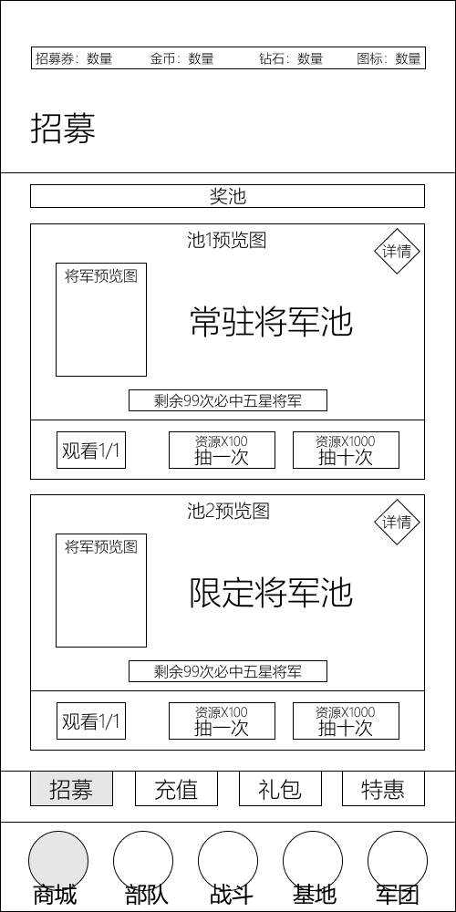

# 模块划分——商城模块

| 版本 | v1.0.0 |
|---|---|
| 日期 | 2026-07-25 |

---

## 一、模块概述

商城模块是游戏商业化的核心入口，承担**将军招募、资源购买、礼包特惠**等职能。商城 Tab 在玩家等级达到 Lv.2 后解锁（将军招募开局 Lv.1 即开放，玩家可在商城 Tab 解锁后通过招募券抽取碎片）。

商城采用"底部 Tab 入口 + 内部二级子导航"结构：底部导航选中"商城"进入商城面板，面板内通过二级子导航（招募 / 充值 / 礼包 / 特惠）切换不同商业化功能。当前原型展示的是"招募"子页。

本模块包含以下界面：

| 界面 | 触发场景 | 对应原型 |
|---|---|---|
| 商城面板（招募页） | 底部导航点击"商城"，默认进入"招募"子页 | `商城面板.png` |

> 资源购买、礼包商店、兵种碎片商店、激励广告等系统设计详见 [商城与商业化](../设计文档/03_局外系统/商城与商业化.md)；货币体系详见 [经济与资源系统](../设计文档/03_局外系统/经济与资源系统.md)。

---

## 二、商城面板（招募页）

底部导航点击"商城"进入，默认展示"招募"子页。

### 2.1 顶部资源栏

商城顶部资源栏显示四栏资源：

| 元素 | 说明 |
|---|---|
| 招募券 | 招募专用资源，单抽 100 / 十连 1000；可通过活动获取、钻石购买等途径补充 |
| 金币 | 基础货币，点击跳转商城购买 |
| 钻石 | 稀有货币，点击跳转商城充值 |
| 第 4 资源 | 原型仅以"图标：数量"占位，未标注具体资源（按通用资源栏推测为体力，待确认） |

> 通用三资源（金币 / 钻石 / 体力）的获取与消耗详见 [经济与资源系统](../设计文档/03_局外系统/经济与资源系统.md) 第 1.1 节。招募券为商城招募专用，局外其他界面顶部资源栏仅显示通用三资源，招募券仅在商城内显示。第 4 栏具体资源待原型明确。

### 2.2 页面标题与奖池入口

| 元素 | 说明 |
|---|---|
| 页面标题 | "招募"，左对齐大字，位于资源栏下方 |
| 奖池标签 | 标题下方横向标签，用于切换 / 筛选可用奖池 |

### 2.3 招募池卡片

招募页展示两张结构一致的招募池卡片，垂直堆叠：

| 招募池 | 说明 |
|---|---|
| 常驻将军池 | 长期开放的将军招募池 |
| 限定将军池 | 限时开放的将军招募池 |

每张卡片包含以下元素：

| 元素 | 位置 | 说明 |
|---|---|---|
| 池预览图标签 | 卡片左侧 | 矩形占位，标注"池X预览图" |
| 详情按钮 | 卡片右上角 | 菱形"详情"按钮，查看奖池内容与概率公示 |
| 将军预览图 | 预览区内 | 标注"将军预览图"，展示当前池可获将军 |
| 池名称 | 预览区右侧 | "常驻将军池" / "限定将军池"，大字居中 |
| 保底提示 | 预览图下方 | "剩余99次必中五星将军"，实时更新剩余次数 |

### 2.4 抽卡操作区

每张招募池卡片底部为三列操作按钮：

| 按钮 | 内容 | 说明 |
|---|---|---|
| 免费抽 | "观看 1/1" | 观看激励广告免费抽 1 次，每日限 1 次（次数 1/1） |
| 单抽 | "资源×100" + "抽一次" | 消耗 100 招募券抽 1 次 |
| 十连 | "资源×1000" + "抽十次" | 消耗 1000 招募券抽 10 次 |

> 抽卡消耗的资源为招募券（单抽 100 / 十连 1000）。招募券可通过活动获取、钻石购买等途径补充。"观看 1/1" 即 [商城与商业化](../设计文档/03_局外系统/商城与商业化.md) 第 1.6 节激励广告的入口。将军抽卡产出碎片，详见同文档第 1.3 节。

### 2.5 二级子导航

招募池卡片下方为商城内部二级子导航，四等分横向排列：

| 子页 | 状态 | 说明 |
|---|---|---|
| 招募 | 当前选中 | 将军招募（常驻 / 限定池），即本页 |
| 充值 | 未选中 | 钻石充值 / 资源购买入口 |
| 礼包 | 未选中 | 限时组合性价比礼包 |
| 特惠 | 未选中 | 折扣专区 |

> 充值、礼包、特惠子页内容当前原型未展示。资源购买详见 [商城与商业化](../设计文档/03_局外系统/商城与商业化.md) 第 1.2 节；礼包商店详见同文档第 1.4 节。设计文档另设"兵种碎片商店"（每日刷新，金币 / 钻石购买兵种碎片，见第 1.5 节），其独立入口在当前原型子导航中未展示，待后续原型确认。

### 2.6 底部导航

5 Tab 底部固定导航，当前所在"商城"Tab 高亮。完整导航结构详见 [全局UI模块](../设计文档/05_UI与交互/全局UI模块.md) 第一章。

| 位置 | Tab | 解锁等级 |
|---|---|---|
| 最左 | 商城（当前选中） | Lv.2 |
| 左二 | 部队 | Lv.1 |
| 中央 | 战斗 | Lv.1 |
| 右二 | 基地 | Lv.6 |
| 最右 | 军团 | Lv.5 |

---

## 三、关联模块

| 关联模块 | 关系 | 参考文档 |
|---|---|---|
| 全局UI模块 | 顶部资源栏、底部 5 Tab 导航 | [全局UI模块](../设计文档/05_UI与交互/全局UI模块.md) |
| 经济与资源系统 | 金币 / 钻石 / 体力货币体系、招募券 | [经济与资源系统](../设计文档/03_局外系统/经济与资源系统.md) |
| 商城与商业化 | 招募、资源购买、礼包、碎片商店、激励广告 | [商城与商业化](../设计文档/03_局外系统/商城与商业化.md) |
| 养成与部队系统 | 碎片产出后进入将军养成 | [养成与部队系统](../设计文档/03_局外系统/养成与部队系统.md) |
| 部队面板（仓库） | 招募所得将军在部队面板编成佩戴 | [部队面板](./部队面板.md) |
