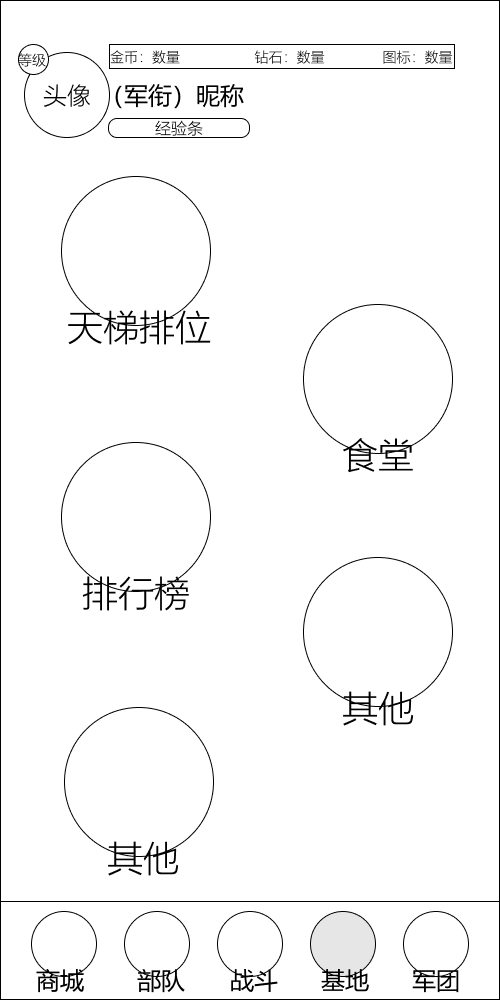
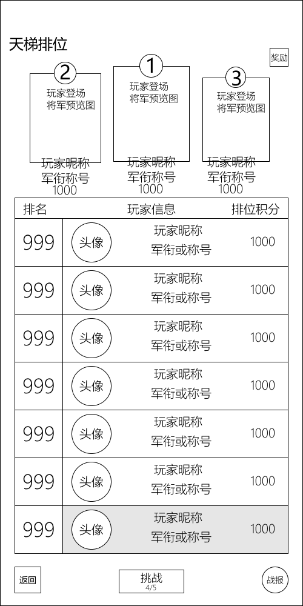

# 模块划分——基地模块

| 版本 | v1.0.0 |
|---|---|
| 日期 | 2026-07-25 |

---

## 一、模块概述

基地模块是 PVP 竞技与扩展功能的聚合入口，承担**天梯排位、排行榜、体力产出**等职能，并预留约架等扩展建筑位。基地 Tab 在玩家等级达到 Lv.6 后解锁（天梯 Lv.6 / 实时约架 Lv.8）。

基地面板以"建筑入口聚合页"形式呈现，点击建筑进入对应子面板。当前原型包含天梯排位（含天梯面板子页）、食堂、排行榜三个已命名建筑，以及两个标注为"其他"的占位建筑与一个空位（功能待定）。

本模块包含以下界面：

| 界面 | 触发场景 | 对应原型 |
|---|---|---|
| 基地面板 | 底部导航点击"基地" | `基地面板.png` |
| 天梯面板 | 基地面板点击"天梯排位"建筑 | `天梯面板.png` |

> 基地 Tab 解锁与导航定位详见 [全局UI模块](../设计文档/05_UI与交互/全局UI模块.md) 第一章；天梯奖励产出的钻石 / 金币详见 [经济与资源系统](../设计文档/03_局外系统/经济与资源系统.md)；实时约架战斗机制详见 [PVP 模式设计](../设计文档/04_游戏模式/PVP模式设计.md)。

---

## 二、基地面板

底部导航点击"基地"进入基地面板，展示玩家信息与建筑入口聚合页。

### 2.1 顶部信息区

固定头部，贯穿全部局外界面。

| 元素 | 位置 | 说明 |
|---|---|---|
| 头像框 | 左上角，圆形 | 玩家角色头像，左上角叠加等级角标 |
| 军衔与昵称 | 头像右侧 | 格式"(军衔) 昵称"，下方为经验进度条 |
| 资源栏 | 顶部横向 | 三栏式：金币 / 钻石 / 体力，点击对应图标跳转商城 |

> 顶部信息区与资源栏为全局通用组件，详见 [全局UI模块](../设计文档/05_UI与交互/全局UI模块.md) 第 1.3 节顶部常驻资源栏。点击头像的个人信息与设置入口详见 [全局UI模块](../设计文档/05_UI与交互/全局UI模块.md) 第三章。

### 2.2 中部建筑入口区

采用错落式网格布局，圆形建筑入口分布在画面中央。当前原型建筑如下：

| 位置 | 建筑 | 规格 | 说明 |
|---|---|---|---|
| 左上 | 天梯排位 | 大圆形 | PVP 天梯排位入口，点击进入天梯面板（见第三章） |
| 右上 | 食堂 | 中圆形 | 体力产出建筑，定时产出 / 存储体力供领取 |
| 左中 | 排行榜 | 大圆形 | 排行榜入口 |
| 右中 | 其他 | 中圆形 | 占位建筑，功能待定 |
| 左下 | 其他 | 大圆形 | 占位建筑，功能待定 |
| 右下 | （空位） | — | 预留扩展位 |

> 视觉层级上，左列大圆形为核心高频功能（天梯、排行榜），右列中圆形为辅助功能（食堂等），通过尺寸差异暗示重要性分级。"其他"两个占位建筑与右下空位功能待定，当前保留占位。按 [全局UI模块](../设计文档/05_UI与交互/全局UI模块.md)，基地还规划有实时约架（Lv.8 解锁）功能，其建筑位在当前原型中尚未分配。

### 2.3 底部导航

5 Tab 底部固定导航，当前所在"基地"Tab 高亮。完整导航结构详见 [全局UI模块](../设计文档/05_UI与交互/全局UI模块.md) 第一章。

| 位置 | Tab | 解锁等级 |
|---|---|---|
| 最左 | 商城 | Lv.2 |
| 左二 | 部队 | Lv.1 |
| 中央 | 战斗 | Lv.1 |
| 右二 | 基地（当前选中） | Lv.6 |
| 最右 | 军团 | Lv.5 |

---

## 三、天梯面板（天梯排位子页）

基地面板点击"天梯排位"建筑进入天梯面板，展示全服排名、前三甲荣誉与挑战入口。

### 3.1 顶部标题与奖励入口

| 元素 | 位置 | 说明 |
|---|---|---|
| 主标题 | 左上角 | "天梯排位" |
| 奖励按钮 | 右上角 | 查看赛季奖励 / 段位奖励 |

### 3.2 前三甲荣誉展示区

领奖台式布局，中央冠军位最高、两侧亚军 / 季军位次高，每处展示：

| 元素 | 说明 |
|---|---|
| 排名序号 | 圆形数字标识 ①②③ |
| 将军预览图 | 标注"玩家登场 将军预览图" |
| 玩家昵称 | 冠 / 亚 / 季军昵称 |
| 军衔称号 | 对应军衔 / 段位称号 |
| 排位积分 | 如 1000 |

### 3.3 排行榜列表

表格结构，展示 4 名以后的排名：

| 列 | 内容 |
|---|---|
| 排名 | 排名序号 |
| 玩家信息 | 头像 + 玩家昵称 + 军衔 / 称号 |
| 排位积分 | 积分值 |

> 列表最底行（自身排名）以浅灰底色高亮，便于定位自身位置。

### 3.4 底部功能栏

| 按钮 | 说明 |
|---|---|
| 返回 | 返回基地面板 |
| 挑战 | 发起天梯挑战，下方标注今日剩余次数（如 4/5） |
| 战报 | 查看历史对战记录 |

> 天梯排位的钻石 / 金币奖励产出（首次排名奖励、赛季结算奖励、日结算奖励、军衔段位奖励）详见 [经济与资源系统](../设计文档/03_局外系统/经济与资源系统.md) 第 1.1 节。天梯对战的战斗机制详见 [PVP 模式设计](../设计文档/04_游戏模式/PVP模式设计.md)。

---

## 四、关联模块

| 关联模块 | 关系 | 参考文档 |
|---|---|---|
| 全局UI模块 | 顶部资源栏、底部 5 Tab 导航、基地 Tab 解锁、个人信息与设置 | [全局UI模块](../设计文档/05_UI与交互/全局UI模块.md) |
| 经济与资源系统 | 天梯奖励产出、体力产出（食堂） | [经济与资源系统](../设计文档/03_局外系统/经济与资源系统.md) |
| PVP 模式 | 天梯对战、实时约架战斗机制 | [PVP 模式设计](../设计文档/04_游戏模式/PVP模式设计.md) |
