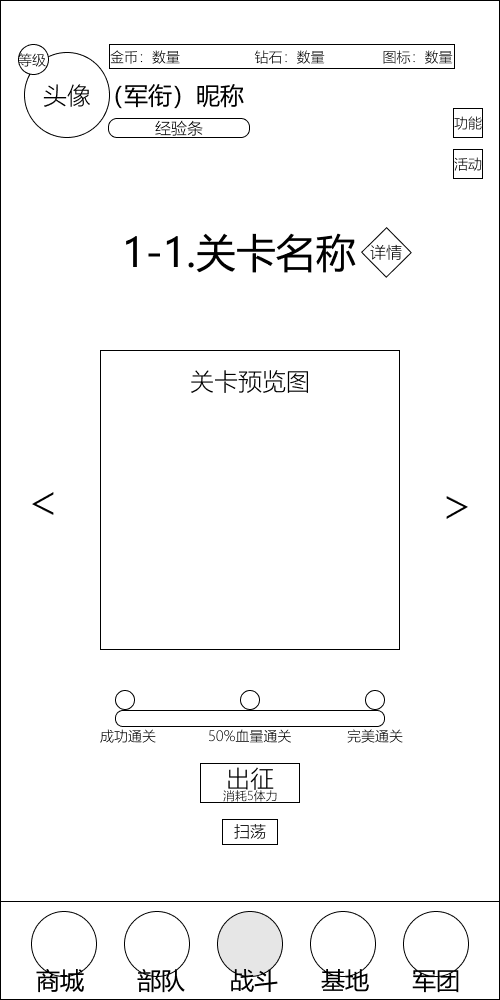
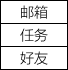
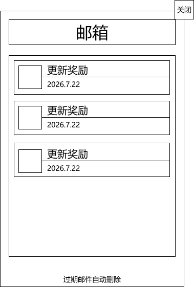
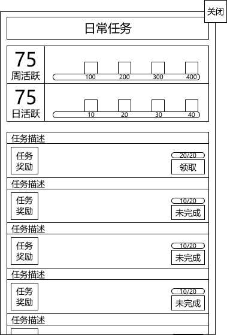
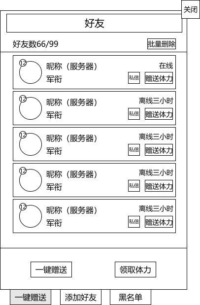
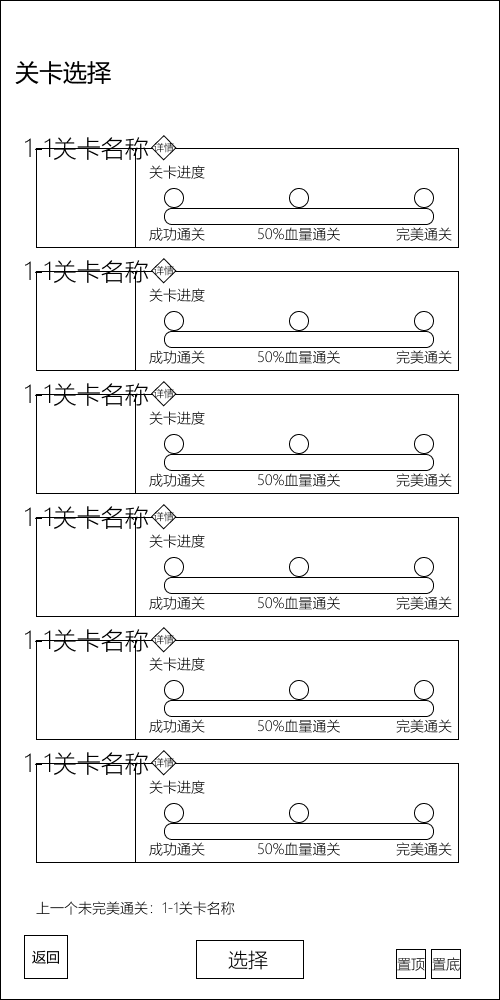
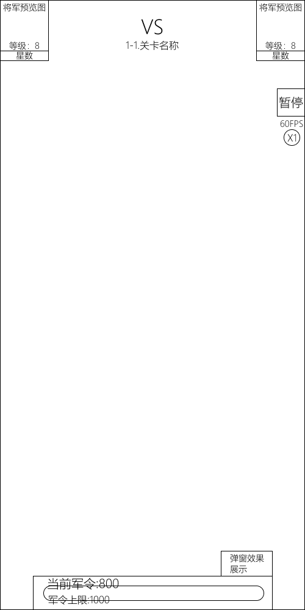
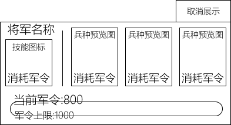
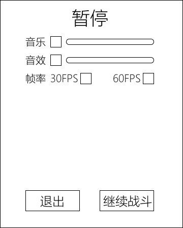

# 模块划分——战斗（PVE）面板模块

| 版本 | v1.0.0 |
|---|---|
| 日期 | 2026-07-25 |

---

## 一、模块概述

战斗（PVE）面板模块是玩家进入游戏后默认所在的核心界面，承担**关卡选择、进入战斗、局内对战、选兵决策、暂停控制**五大职能。该模块贯穿 PVE 单局的完整生命周期：从局外关卡选择 → 出征进入战斗 → 局内军令决策 → 战斗暂停/退出 → 结算返回。

本模块包含以下界面（含从战斗面板触发的功能弹窗）：

| 界面 | 触发场景 | 对应原型 |
|---|---|---|
| 战斗面板（默认） | 进入游戏默认 Tab，关卡选择入口 | `战斗面板（默认）.png` |
| 功能展开效果 | 点击右上方"功能"按钮 | `功能展开效果.png` |
| 邮箱弹窗 | 功能菜单中点击"邮箱" | `邮箱弹窗.png` |
| 任务弹窗 | 功能菜单中点击"任务" | `任务弹窗.png` |
| 好友弹窗 | 功能菜单中点击"好友" | `好友弹窗.png` |
| 个人信息弹窗 | 点击左上角头像，"信息"标签页 | `个人信息弹窗.png` |
| 设置弹窗 | 点击左上角头像，"设置"标签页 | `设置弹窗.png` |
| 局内战斗面板 | 点击"出征"进入 PVE 对局 | `局内战斗面板.png` |
| 军令满条弹窗 | 局内军令条达到上限（1000） | `军条满了的弹窗.png` |
| 局内暂停弹窗 | 局内点击右上角"暂停"按钮 | `局内暂停弹窗.png` |

> 关卡推进规则、三星评价、扫荡机制等数值与系统设计详见 [PVE 模式设计](../设计文档/04_游戏模式/PVE模式设计.md)；战场布局、军令机制、操作流程详见 [战场与操作](../设计文档/02_核心战斗/战场与操作.md)。

---

## 二、战斗面板（默认关卡选择界面）

进入游戏后默认停留在战斗 Tab，展示当前章节的关卡选择界面。



### 2.1 顶部信息区

固定头部，贯穿全部局外界面，展示玩家状态与全局资源。

| 元素 | 位置 | 说明 |
|---|---|---|
| 头像框 | 左上角，圆形 | 玩家角色头像，点击弹出个人信息与设置（见第六章） |
| 等级徽章 | 头像左下角，圆形 | 标注当前玩家等级 |
| 军衔与昵称 | 头像右侧 | 显示"(军衔) 昵称"，下方为经验进度条 |
| 资源栏 | 顶部中央偏右 | 三栏式：金币 / 钻石 / 体力，点击对应图标跳转商城 |
| 功能按钮 | 右上方 | 上方"功能"按钮、下方"活动"按钮，均为方形入口 |

**功能按钮说明**：

| 按钮 | 弹出内容 | 解锁等级 |
|---|---|---|
| 功能 | 点击后向下展开下拉菜单，提供邮箱、任务、好友三个入口 | Lv.2 起 |
| 活动 | 活动面板（限时活动、签到福利） | Lv.3 |

#### 功能展开菜单

点击右上方"功能"按钮后，向下展开垂直下拉菜单，包含三个等宽入口项：



| 菜单项 | 说明 | 弹出界面 |
|---|---|---|
| 邮箱 | 系统邮件、奖励领取入口，新邮件时功能按钮显示红点 | 邮箱弹窗（见下） |
| 任务 | 日常/周常任务入口，有可领取奖励时显示红点 | 任务弹窗（见下） |
| 好友 | 好友列表、申请、互动入口，收到好友申请时显示红点 | 好友弹窗（见下） |

#### 邮箱弹窗

点击菜单中"邮箱"项弹出邮箱弹窗。标题栏居中显示"邮箱"，右上角为"关闭"按钮。



| 元素 | 说明 |
|---|---|
| 邮件列表 | 垂直堆叠的邮件卡片，每张卡片左侧为类型图标占位区，右侧上方为邮件标题（如"更新奖励"），下方为日期 |
| 底部提示 | "过期邮件自动删除"文字提示 |

> 邮件分类、领取奖励、有效期等详细规则见 [全局UI模块](../设计文档/05_UI与交互/全局UI模块.md) 第 5.1 节邮箱系统。

#### 任务弹窗

点击菜单中"任务"项弹出任务弹窗。标题栏居中显示"日常任务"，右上角为"关闭"按钮。



| 区域 | 说明 |
|---|---|
| 活跃度统计 | 左侧显示周活跃与日活跃数值，右侧为对应进度条（周活跃标记点 100/200/300/400，日活跃标记点 10/20/30/40） |
| 任务列表 | 垂直堆叠的任务卡片，每张包含任务描述、任务奖励预览、进度指示器（如 `20/20`）、操作按钮 |
| 领取按钮 | 任务完成时点亮"领取"按钮，未完成时显示"未完成"禁用状态 |

> 任务类型、活跃度宝箱、一键领取等详细规则见 [全局UI模块](../设计文档/05_UI与交互/全局UI模块.md) 第 5.2 节任务系统。

#### 好友弹窗

点击菜单中"好友"项弹出好友弹窗。标题居中显示"好友"，右上角为"关闭"按钮。



| 区域 | 说明 |
|---|---|
| 好友统计 | 左侧显示"好友数 66/99"（当前/上限），右侧为"批量删除"按钮 |
| 好友列表 | 每条好友包含：等级图标、头像、昵称（服务器）、军衔、在线状态（在线/离线 X 小时）、私信按钮、赠送体力按钮 |
| 批量操作 | 列表下方提供"一键赠送"与"领取体力"按钮 |
| 底部导航 | 三个入口：一键赠送 / 添加好友 / 黑名单 |

> 好友上限、添加好友、好友互动等详细规则见 [全局UI模块](../设计文档/05_UI与交互/全局UI模块.md) 第 5.3 节好友系统入口。

### 2.2 中部关卡展示区

界面核心视觉区，展示当前选中关卡的信息与操作入口。

| 元素 | 说明 |
|---|---|
| 关卡标题 | 格式 `章节-序号.关卡名称`（如 `1-1.关卡名称`），右侧带菱形"详情"按钮 |
| 关卡预览图 | 占据界面主要视觉空间，展示关卡地形主题 |
| 左右切换箭头 | 预览图两侧 `<` `>`，切换上一关/下一关（仅可在已解锁关卡间切换） |
| 通关进度条 | 三节点进度指示器，对应下方三个通关条件 |
| 通关条件标签 | 从左到右：成功通关 / 50%血量通关 / 完美通关，对应一/二/三星 |
| 出征按钮 | 主按钮，文字"出征"，副标题"消耗5体力"，点击进入战斗 |
| 扫荡按钮 | 出征按钮下方，仅已三星通关的关卡显示，点击弹出关卡扫荡 |

**详情按钮**：点击菱形"详情"按钮弹出关卡详情弹窗，展示关卡信息、敌方配置预览、胜利条件、三星条件、可能掉落、体力消耗、当前最佳记录（详见 [PVE 模式设计](../设计文档/04_游戏模式/PVE模式设计.md) 第四章）。

### 2.3 底部导航区

5 Tab 底部固定导航，当前所在"战斗"Tab 高亮。完整导航结构详见 [全局UI模块](../设计文档/05_UI与交互/全局UI模块.md) 第一章。

| 位置 | Tab | 解锁等级 |
|---|---|---|
| 最左 | 商城 | Lv.2 |
| 左二 | 部队 | Lv.1 |
| 中央 | 战斗（当前选中） | Lv.1 |
| 右二 | 基地 | Lv.6 |
| 最右 | 军团 | Lv.5 |

### 2.4 出征前置条件

点击"出征"按钮进入战斗前需满足以下条件，否则按钮置灰并提示：

| 条件 | 说明 |
|---|---|
| 兵种槽位 | 8 个兵种槽位必须全部填充 |
| 将军槽 | 1 个将军槽必须选择将军 |
| 体力 | ≥ 5 点，不足时按钮置灰，提示"体力不足，前往商城恢复" |

> 兵种编成、将军佩带和卡组预设均在 [部队面板](./部队面板.md) 中完成，战斗面板不介入编成流程。

### 2.5 关卡列表视图

除默认的单关预览外，关卡选择亦提供列表视图，纵向展示当前章节的全部关卡。



| 元素 | 说明 |
|---|---|
| 标题 | "关卡选择" |
| 关卡卡片 | 每张含关卡预览图、`章节-序号 关卡名称`（如 `1-1 关卡名称`）、锁图标（未解锁）、三节点通关进度（成功通关 / 50%血量通关 / 完美通关） |
| 底部提示 | "上一个未完美通关：1-1 关卡名称"，快捷定位未完美通关关卡 |
| 导航按钮 | 返回 / 选择 / 置顶 / 置底 |

> 该列表视图与 2.2 节单关预览的切换入口以最终交互设计为准。

---

## 三、局内战斗面板

点击"出征"后进入战斗加载，加载完成展示局内战斗面板。战场为俯视角固定战场（类《皇室战争》），己方大本营在下，敌方在上，兵种从己方半场部署点位出发自动向敌方推进。



### 3.1 顶部对战信息区

三方水平对称布局，建立对战认知。

| 位置 | 元素 | 内容 |
|---|---|---|
| 左上角 | 己方将军信息面板 | 将军预览图 + 等级 + 星数 |
| 顶部中央 | 对战核心信息 | "VS"标识 + "章节-序号 关卡名称" |
| 右上角 | 敌方将军信息面板 | 将军预览图 + 等级 + 星数（与左侧镜像对称） |

### 3.2 右上系统控制区

垂直排列于右上角，提供局内系统控制。

| 元素 | 说明 |
|---|---|
| 暂停按钮 | 点击弹出局内暂停弹窗（见第五章） |
| FPS 显示 | 实时帧率显示，表明性能状态 |
| 倍速按钮 | 圆形按钮，切换战斗速度（当前为 X1） |

### 3.3 底部军令系统

局内最核心的资源显示区，位于屏幕底部、大本营上方。

| 元素 | 说明 |
|---|---|
| 军令条容器 | 圆角矩形外框，占据底部约 60% 宽度 |
| 当前军令 | 实时可用军令值（如 `当前军令:800`） |
| 军令上限 | 固定 `军令上限:1000` |
| 进度条 | 横向填充条，直观显示当前/上限比例 |

**军令机制**：

| 维度 | 说明 |
|---|---|
| 上限 | 1000 |
| 回复速度 | 0~120s 正常模式每秒 100；121~180s 狂暴模式每秒 200 |
| 满条触发 | 军令满 1000 时弹出四选一弹窗，PVE 游戏暂停（见第四章） |
| 弹窗提示 | 军令条右上方预留"弹窗效果展示"区域，用于临时提示/BUFF 说明 |

### 3.4 中央战场区

界面中央大面积留白为战斗展示区域，实时显示兵种、将军、大本营等战斗实体。双方大本营生命值（HP）与护盾值在战场内呈现，护盾存在时不扣除真实血量。

---

## 四、军令满条弹窗（四选一）

局内军令条达到上限（1000）时，游戏暂停并弹出四选一决策弹窗。玩家从随机抽取的选项中选择部署兵种或释放将军技能。



### 4.1 界面布局

采用横向三栏式布局，左侧为将军信息区，右侧为兵种选择区。

| 区域 | 位置 | 内容 |
|---|---|---|
| 取消展示按钮 | 右上角 | 点击关闭弹窗（即弃选） |
| 将军信息区 | 左侧（约 25% 宽） | 将军名称 + 技能图标 + 消耗军令 |
| 兵种选择区 | 右侧（约 75% 宽） | 三列等分，每列：兵种预览图 + 消耗军令 |
| 军令状态栏 | 底部 | 当前军令 + 军令上限 + 进度条 |

### 4.2 选项内容

弹窗共展示 4 个选项，玩家四选一：

| 选项 | 来源 | 说明 |
|---|---|---|
| 兵种 ×3 | 从 8 个携带兵种中随机抽取 | 每个兵种显示预览图与消耗军令 |
| 将军技能 ×1 | 当前佩带将军的主动技能 | 显示技能图标与消耗军令 |

> 兵种编成在局外部队模块完成，携带的 8 个兵种决定了局内可被抽取的兵种池。每局可用兵种与技能组合不同，避免固定套路。

### 4.3 操作与消耗

| 操作 | 说明 |
|---|---|
| 选择兵种 | 消耗对应军令值，兵种从己方半场部署点位出发，沿所属路线自动推进 |
| 释放将军技能 | 消耗对应军令值，技能释放范围覆盖全场，无半场限制 |
| 弃选 | 点击"取消展示"，消耗 100 军令跳过本轮，不部署任何单位 |

**决策逻辑**：将军技能与兵种召唤形成资源互斥选择，玩家需权衡即时技能收益与长期兵种投资。选择后弹窗关闭，游戏恢复，军令继续增长直至再次满条。

---

## 五、局内暂停弹窗

局内点击右上角"暂停"按钮，弹出半屏暂停弹窗，提供音量、帧率调整与对局退出控制。



### 5.1 标题区

顶部居中显示"暂停"标题，明确状态反馈，打断用户操作流。

### 5.2 设置项区

左对齐块状排列，标签与控件横向布局，支持快速扫描调整。

| 设置项 | 控件 | 说明 |
|---|---|---|
| 音乐 | 复选框 + 滑动条 | 复选框为主开关（取消勾选静音），滑动条精细调节音量 0-100% |
| 音效 | 复选框 + 滑动条 | 同音乐，控制战斗音效与 UI 交互音效 |
| 帧率 | 30FPS / 60FPS 单选 | 互斥单选，切换战斗帧率 |

> 局外完整的画质、推送、隐私等设置详见 [全局UI模块](../设计文档/05_UI与交互/全局UI模块.md) 第四章设置模块。局内暂停弹窗仅保留战斗中高频使用的音量与帧率两项。

### 5.3 操作按钮区

底部双按钮水平排列，主次分明。

| 按钮 | 位置 | 说明 |
|---|---|---|
| 退出 | 底部偏左 | 退出当前对局，返还锁定体力（不消耗），返回关卡选择界面 |
| 继续战斗 | 底部偏右 | 关闭弹窗，恢复战斗 |

---

## 六、头像入口（个人信息与设置）

点击战斗面板左上角头像，弹出个人信息与设置面板（含信息、设置标签页）。该入口的界面规格、元素说明及关联详见 [全局UI模块](../设计文档/05_UI与交互/全局UI模块.md) 第三章，此处不再重复。

---

## 七、交互流程总览

```
进入游戏 → 战斗面板（默认关卡选择）
    │
    ├─ 点击头像 → 个人信息与设置弹窗
    ├─ 点击"功能" → 任务/好友/邮箱聚合弹窗
    ├─ 点击"活动" → 活动面板
    ├─ 点击"详情" → 关卡详情弹窗
    ├─ 点击"扫荡" → 关卡扫荡弹窗（需三星通关）
    │
    └─ 点击"出征"（满足前置条件）→ 局内战斗面板
            │
            ├─ 军令满 1000 → 四选一弹窗（游戏暂停）
            │       ├─ 选兵种 → 部署并继续
            │       ├─ 释放将军技能 → 释放并继续
            │       └─ 弃选 → 消耗 100 军令并继续
            │
            ├─ 点击"暂停" → 局内暂停弹窗
            │       ├─ 点击"继续战斗" → 恢复战斗
            │       └─ 点击"退出" → 返回关卡选择（返还体力）
            │
            └─ 战斗结束 → 结算界面（胜负/星级/奖励）
                    ├─ 返回关卡
                    ├─ 下一关
                    └─ 再次挑战
```

---

## 八、关联模块

| 关联模块 | 关系 | 参考文档 |
|---|---|---|
| 部队面板（仓库） | 提供局内携带的 8 兵种与将军，战斗面板不介入编成 | [部队面板](./部队面板.md) |
| 全局UI模块 | 顶部资源栏、底部 5 Tab 导航、个人信息与设置、设置模块 | [全局UI模块](../设计文档/05_UI与交互/全局UI模块.md) |
| PVE 模式 | 关卡推进、三星评价、扫荡、体力消耗、结算 | [PVE 模式设计](../设计文档/04_游戏模式/PVE模式设计.md) |
| 战场与操作 | 军令机制、四选一、大本营、路线、时缓 | [战场与操作](../设计文档/02_核心战斗/战场与操作.md) |
