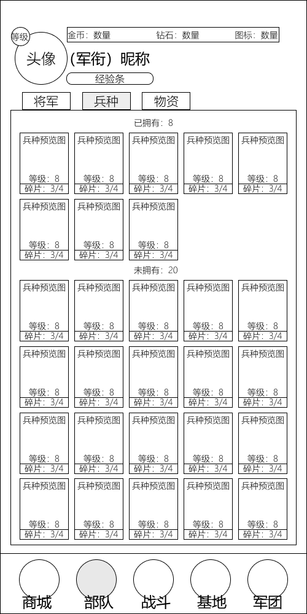
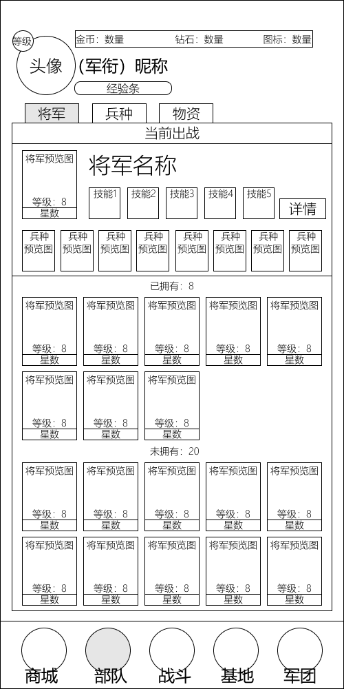
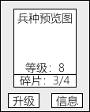
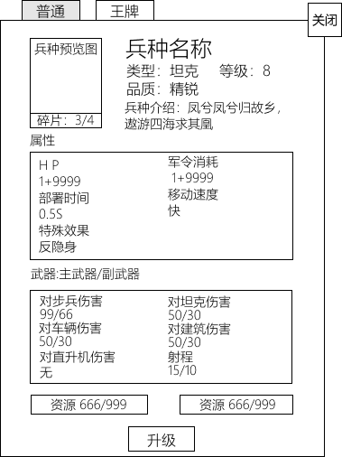
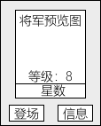
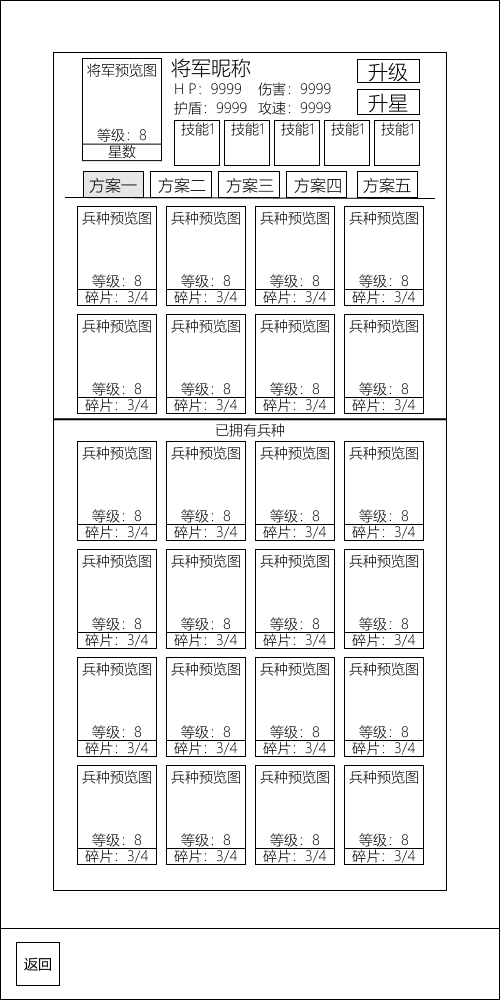
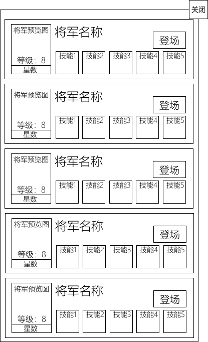
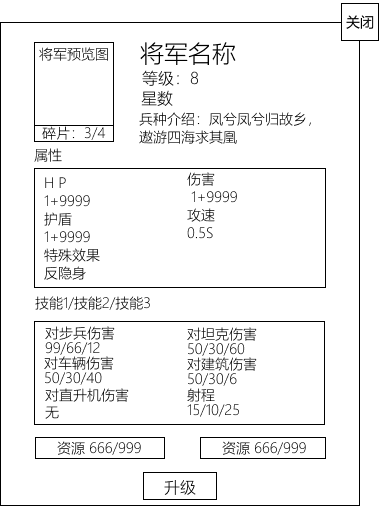
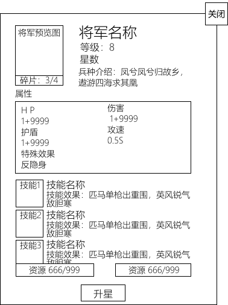
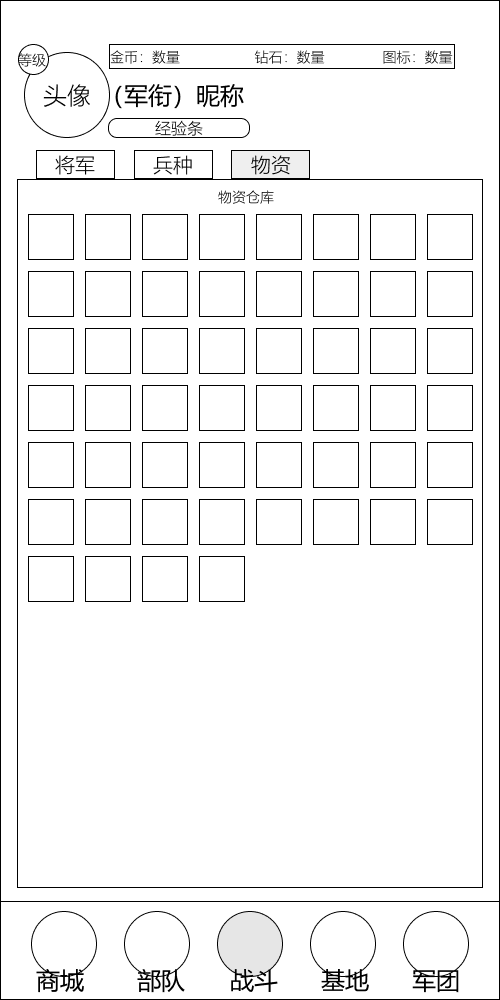

# 部队面板（仓库）模块

| 版本 | v1.0.0 |
|---|---|
| 日期 | 2026-07-20 |

> 本文档为草稿阶段，详细设计见 [养成与部队系统](../设计文档/03_局外系统/养成与部队系统.md)。

## 1. 概述

部队面板用于配置带入对局的 8 个兵种和 1 个将军，升级兵种和将军，查看详细属性，以及检查物资。

- 兵种通过拖拽进行替换，将军直接点击登场
- 部队面板分为四个子模块（兵种、将军、物资、其他），默认展示兵种面板
- 兵种界面点击兵种可查看详细信息
- 将军预览框默认展示已登场的将军

## 2. UI 参考
交互流程：将军与兵种均可点击。兵种点击后出现"升级"与"信息"按钮（升级条件未满足为灰色）；将军点击后出现"登场"与"信息"按钮。点击"信息"进入详情面板查看详细属性，将军的升级与升星由详情面板进入（将军升级弹窗 / 将军升星弹窗，消耗碎片与资源）。携带兵种可通过拖拽替换，将军可通过拖拽、将军选择面板的"登场"或详情面板进行替换。画面比例按图示比例参考。

| 界面 | 示意图 |
|---|---|
| 部队 Tab 兵种界面 |  |
| 部队 Tab 将军界面 |  |
| 兵种点击效果 |  |
| 兵种详情弹窗 |  |
| 将军点击效果 |  |
| 将军详情面板 |  |
| 将军选择面板 |  |
| 将军升级弹窗 |  |
| 将军升星弹窗 |  |
| 部队 Tab 物资界面 |  |

将军养成与选择：将军选择面板以列表展示全部将军（预览图、等级、星数、5 个技能槽、登场按钮），用于佩带替换；将军升级弹窗显示碎片进度（如 3/4）、属性（HP / 护盾 / 伤害 / 攻速 / 特殊效果）、技能与两种资源消耗（如 666/999），点击"升级"提升等级；将军升星弹窗结构相似，消耗碎片与资源"升星"解锁属性成长。

## 3. 详细规格

详细设计规格见 [养成与部队系统](../设计文档/03_局外系统/养成与部队系统.md)，包含：
- 军营升级（HP/护盾/反击）
- 兵种管理（列表/详情/升级/解锁）
- 将军管理（列表/详情/被动与主动技能）
- 卡组编成（8 兵种 + 1 将军、多套预设）