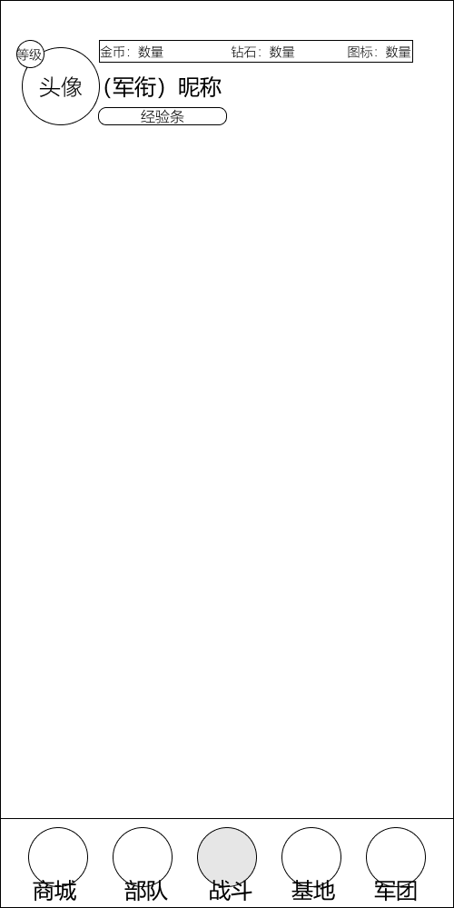
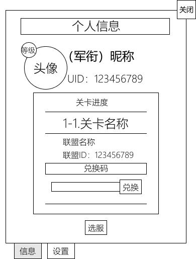
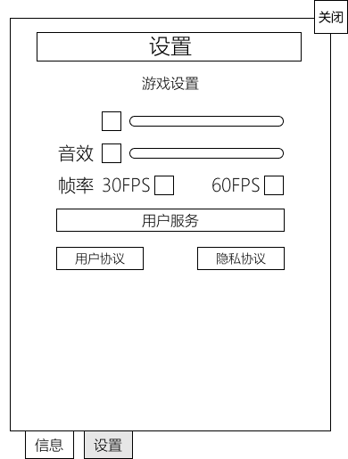

# 全局UI模块

| 版本 | v1.1.0 |
| 日期 | 2026-07-26 |

> 本文档由《主界面与导航设计》与《等级系统与个人信息和设置》合并而成,整合主界面导航、等级系统、个人信息与设置面板及局外功能组件的全局 UI 设计,并清除两份源文档间的重复描述与交叉引用。

---

## 一、导航结构总览

> 图示:主界面顶部个人信息资源栏与底部 5 Tab 导航栏的整体布局。

### 1.1 5 Tab 底部导航

主界面采用**底部固定 Tab 栏**,5 个一级入口覆盖全部核心功能模块:

| Tab | 名称 | 对应功能 | 默认解锁 |
|---|---|---|---|
| 1 | 商城 | 资源购买、将军招募、礼包、兵种碎片商店 | Lv.2 |
| 2 | 部队 | 军营、兵种管理、将军管理、卡组编成 | Lv.1 |
| 3 | 战斗 | PVE 关卡地图、章节选择 | Lv.1 |
| 4 | 基地 | PVP 天梯、实时约架、排行榜 | Lv.6（天梯）/ Lv.8（约架） |
| 5 | 军团 | 军团主页、成员列表、聊天、捐赠 | Lv.5 |

**交互规则**:
- Tab 切换为即时切换,无需加载
- 未解锁 Tab 显示锁定图标,点击提示解锁条件
- 当前所在 Tab 高亮,其余 Tab 显示是否有红点提示(未读消息/待处理事项)

### 1.2 顶部个人信息入口

主界面顶部左上角区域,头像、等级角标、军衔与昵称、经验进度条一体展示;点击该区域弹出个人信息与设置面板(详见[[#三、个人信息与设置面板]])。

> 入口位置示意图待补充。各局外面板(战斗 / 基地 / 军团等)顶部左上角均为此入口,参见 [战斗（PVE）面板模块](../模块文档/战斗PVE面板.md) 第 2.1 节顶部信息区。

### 1.3 顶部常驻资源栏

所有主界面(含各 Tab 子页面)顶部固定显示资源栏,贯穿全部局外模块:

| 资源 | 图标 | 说明 |
|---|---|---|
| 金币 | 金币图标 | 基础货币,点击可跳转商城购买 |
| 钻石 | 钻石图标 | 稀有货币,点击可跳转商城充值 |
| 体力 | 体力图标 | 当前值/上限,点击展示恢复倒计时和购买入口 |

**交互规则**:
- 资源数字变化时播放数值滚动动画
- 资源不足时对应图标闪烁提示
- 体力值旁显示距离下次恢复的倒计时

### 1.4 顶部功能区

资源栏右侧或同高度区域包含以下功能按钮:

| 入口 | 说明 | 解锁等级 |
|---|---|---|
| 功能 | 点击展开下拉菜单,提供邮箱、任务、好友三个入口 | Lv.2起 |
| 活动 | 限时活动、签到福利入口 | Lv.3 |

> 设置通过左上角头像弹出的面板进入(详见 3.3 设置标签页)。顶部各入口(导航 Tab、个人信息、资源栏、功能区)的解锁等级总览详见 [[#2.2 功能解锁节奏]]。

---

## 二、等级系统

### 2.1 概述

玩家账户等级反映整体游戏进度和投入程度,是功能解锁和养成上限的核心控制参数。

| 维度 | 说明 |
| ---- | --- |
| 等级定位 | 玩家账户等级,区别于 PVP 荣誉等级和兵种/将军等级(养成等级);等级对应军衔称号,详见[[#2.5 等级军衔划分]] |
| 等级上限 | 60 级,满级后不再获取经验,已解锁功能不受影响 |
| 经验来源 | 每局体力结算时固定获得 10 点经验(PVE/PVP 均适用);日常任务、周常任务提供额外经验 |
| 经验需求 | 采用幂函数递增公式,前期升级快(1-2 局/级),后期逐渐放慢,详见[[#2.4 经验公式]] |
| 等级展示 | 主界面左上角头像、等级角标、军衔昵称、经验进度条一体展示;点击弹出个人信息与设置面板,详见[[#三、个人信息与设置面板]] |

### 2.2 功能解锁节奏

通过玩家等级逐步开放局外功能模块,保证新手体验平滑:

| 等级 | 解锁内容 | 说明 |
| ---- | --- | --- |
| Lv.1 | 战斗(PVE)、部队基础功能(含将军管理)、将军招募 | 新手进入游戏即可体验 PVE 和基础养成,将军招募开局开放;开局默认获得初始将军"前线指挥官" |
| Lv.2 | 商城基础功能(资源购买)、邮箱 | 解锁商城基础功能,邮箱可接收系统邮件 |
| Lv.3 | 任务系统 | 解锁日常任务,引导玩家建立每日活跃习惯 |
| Lv.4 | 好友系统 | 解锁好友添加和互动功能 |
| Lv.5 | 军团 | 解锁军团创建和加入,引入社交粘性 |
| Lv.6 | 基地(PVP 天梯) | 解锁异步天梯,引入竞技元素 |

> 新手引导流程在 Lv.1-3 期间通过新手引导任务串联,确保玩家在解锁每个新功能时都有明确的使用引导。本表为等级视角的功能解锁总览;各入口在主界面导航中的具体位置见第一章。

### 2.3 等级资源投放 — 等级礼包

等级礼包采用**包含嵌套**机制:每个礼包打开后获得当前等级奖励,同时获得下一档等级礼包;等级不足时礼包保留在仓库中不可打开,但可预览内容。

#### 2.3.1 礼包链条

玩家开局默认为 Lv.1,Lv.1 礼包自动发放至仓库。打开 Lv.1 礼包获得 Lv.5 礼包,打开 Lv.5 礼包获得 Lv.10 礼包,以此类推:

`Lv.1 → Lv.5 → Lv.10 → Lv.15 → Lv.20 → Lv.25 → Lv.30 → Lv.35 → Lv.40 → Lv.45 → Lv.50 → Lv.55 → Lv.60`

共计 13 个礼包,每个礼包包含当前等级奖励 + 下一档礼包。

#### 2.3.2 打开规则

| 规则 | 说明 |
| ---- | ---- |
| 可打开 | 玩家等级 ≥ 礼包等级时,可打开礼包,获得当前等级奖励 + 下一档礼包(放入仓库) |
| 不可打开 | 玩家等级 < 礼包等级时,礼包保留在仓库中,按钮灰显,但可点击预览礼包内容 |
| 预览 | 未满足等级的礼包可查看内含奖励,激励玩家追求升级 |

#### 2.3.3 礼包内容

| 维度 | 说明 |
| ---- | ---- |
| 各等级奖励 | 钻石、金币、招募券、养成材料、特殊资源(特定等级)等 |
| 过期机制 | 永久有效,满足等级后随时可打开,无时间限制 |
| 付费升级 | 部分关键等级(如 Lv.10、Lv.20、Lv.30...Lv.60)提供付费升级档位,购买后可额外获得更高价值奖励 |

#### 2.3.4 礼包弹窗 UI

打开等级礼包时弹出礼包详情弹窗,展示以下内容:

- **礼包标题**:显示礼包等级(如"Lv.10 等级礼包")
- **奖励列表**:以图标 + 数量网格形式展示礼包内所有奖励物品
- **打开按钮**:按钮位于弹窗底部,高亮显示;点击后播放开启动画(礼包打开特效 → 奖励飞入仓库),并发放下一档礼包至仓库
- **关闭按钮**:弹窗右上角 X 按钮,点击关闭弹窗;若礼包未打开,礼包保留在仓库中
- **已满足等级**:打开按钮可点击,正常高亮
- **未满足等级**:打开按钮灰显,不可点击,仅可预览奖励内容

> 等级礼包与新手引导任务奖励相互独立,两者叠加确保玩家在成长各阶段均有正向反馈。

### 2.4 经验公式

#### 2.4.1 公式定义

升至下一级所需经验:`Exp(n) = round(n^1.3 + 5)`,其中 n 为当前等级。

- 幂函数指数 1.3,曲线平滑无断层,前期体感变化自然
- 常数 +5 保证 Lv.1 也有最低门槛(1 局),避免经验值为 0
- 单局基础经验 10 点(体力结算时固定获得),纯战斗约 1150 局满级;叠加任务经验后活跃玩家预计 2 个月左右满级

#### 2.4.2 关键等级经验表

| 等级 | 升至下一级所需经验 | 需要战斗局数 | 累计战斗局数 |
| ---- | ---- | ---- | ---- |
| Lv.1 | 6 | 1 局 | 1 局 |
| Lv.5 | 13 | 2 局 | 8 局 |
| Lv.10 | 25 | 3 局 | 25 局 |
| Lv.15 | 39 | 4 局 | 55 局 |
| Lv.20 | 54 | 6 局 | 100 局 |
| Lv.25 | 71 | 8 局 | 160 局 |
| Lv.30 | 89 | 9 局 | 238 局 |
| Lv.35 | 108 | 11 局 | 335 局 |
| Lv.40 | 127 | 13 局 | 450 局 |
| Lv.45 | 148 | 15 局 | 585 局 |
| Lv.50 | 169 | 17 局 | 745 局 |
| Lv.55 | 190 | 19 局 | 930 局 |
| Lv.60 | — | 21 局 | 1150 局 |

> 以上仅按纯战斗经验(10 点/局)计算;实际升级速度会因日常任务、周常任务等额外经验叠加而更快。上线后可根据数据调整系数,公式结构不变,改动成本低。

### 2.5 等级军衔划分

玩家账户等级对应军衔称号,随等级提升自动晋升,展示在个人信息和聊天频道中。

| 游戏等级 | 军衔 |
| ---- | ---- |
| Lv.1 | 列兵 |
| Lv.2 | 上等兵 |
| Lv.3 | 士官 |
| Lv.4 | 军士长 |
| Lv.5 | 准尉 |
| Lv.6–10 | 少尉 |
| Lv.11–15 | 中尉 |
| Lv.16–20 | 上尉 |
| Lv.21–25 | 少校 |
| Lv.26–30 | 中校 |
| Lv.31–35 | 上校 |
| Lv.36–40 | 大校 |
| Lv.41–45 | 少将 |
| Lv.46–50 | 中将 |
| Lv.51–55 | 上将 |
| Lv.56–60 | 元帅(最高军衔) |

> 军衔称号与等级一一对应,与 PVP 荣誉等级(如天梯段位)相互独立。

### 2.6 升级表现与反馈

#### 2.6.1 升级弹窗

玩家升级时屏幕中间弹出升级提示,展示:

- 等级变化:`Lv(n) → Lv(n+1)`,数字以放大动效切换
- 向上放出光芒特效(金色光柱从底部向上扩散)
- 新军衔称号展示(如军衔发生变化)
- 若该等级解锁新功能,附带解锁提示("已解锁:XXX")
- 若该等级有等级礼包,附带打开引导按钮

#### 2.6.2 跨级升级

一次经验获取可能导致跨越多个等级(如从 Lv.3 升至 Lv.5):

- **逐级弹窗**:依次弹出每一级的升级弹窗,玩家可逐级看到等级变化和军衔晋升
- 每次弹窗间隔约 1 秒,自动切换,无操作可快速跳过
- 若跨级涉及新功能解锁,在对应等级弹窗中展示解锁提示

#### 2.6.3 新功能解锁聚焦指引

升级弹窗关闭后,若本次升级解锁了新功能模块,主界面该功能入口处出现聚焦指引:

- **视觉表现**:目标入口高亮发光,周围区域半透明遮罩,指引箭头指向入口位置,附带功能名称文字气泡
- **交互方式**:玩家点击指引区域任意位置即可解除遮罩和聚焦效果
- **解除后**:功能入口恢复正常显示,入口处保留红点提示(首次解锁),引导玩家点击进入体验
- **多入口解锁**:若一次升级解锁多个功能,依次展示聚焦指引,每次点击解除后切换到下一个目标

### 2.7 经验结算流程

#### 2.7.1 不升级情况

对局结束或领取任务奖励后,若经验不足以升级:

- 不弹出任何弹窗
- 主界面左上角经验条按比例直接增长至新位置
- 无音效、无特效,仅经验条数字更新

#### 2.7.2 升级情况

经验结算触发升级时,按以下流程处理:

1. 结算界面展示经验获取数值
2. 判断是否升级,若升级则进入[[#2.6 升级表现与反馈|升级弹窗流程]]
3. 弹窗结束后,主界面经验条刷新至当前等级对应进度
4. 若触发多个等级升级,逐级弹窗完成后最终刷新经验条

### 2.8 满级后处理

- Lv.60 满级后,不再获取经验
- 经验来源(战斗结算、任务奖励)中的经验部分不再生效,其余奖励(金币、材料等)照常发放
- 满级玩家展示特殊标识:军衔"元帅"、头像框特殊边框效果
- 满级后溢出的经验不做转化,直接废弃

---

## 三、个人信息与设置面板

点击主界面左上角头像入口(详见 1.2)弹出面板,底部设有标签页切换不同页面。当前原型展示"信息"与"设置"两个标签页(设计另规划"通知"标签页,UI 未展示)。

### 3.1 信息标签页(默认展示)

| 区域 | 元素 | 说明 |
|---|---|---|
| 顶部标题 | "个人信息" | 弹窗顶部居中 |
| 用户基础信息 | 头像 + 等级角标 | 左侧圆形头像,左上角叠加等级角标 |
| | 军衔与昵称 | 头像右侧,格式"(军衔) 昵称" |
| | UID | 昵称下方,格式"UID: 123456789" |
| 信息卡片 | 关卡进度 | 当前关卡编号与名称(如"1-1.关卡名称") |
| | 军团信息 | 军团名称与军团 ID |
| | 兑换码 | 兑换码输入框 + "兑换"按钮 |
| 功能入口 | 选服按钮 | 信息卡片下方,点击打开服务器选择 |
| 底部导航 | 信息 / 设置 | 标签页切换,"信息"为当前选中 |

### 3.2 通知标签页(设计规划,UI 未展示)

| 模块 | 说明 |
|---|---|
| 其他通知 | 游戏维护、版本更新、活动公告等系统级消息列表 |
| 体力通知 | 等级礼包可领取、任务奖励待领取、邮件附件等提醒 |

> 通知标签页为设计规划内容,当前 UI 原型未展示,示意图待补充。

### 3.3 设置标签页

| 区域 | 元素 | 说明 |
|---|---|---|
| 顶部标题 | "设置" | 弹窗顶部居中 |
| 游戏设置 | 音乐 | 复选框(主开关)+ 滑动条(音量调节 0-100%) |
| | 音效 | 复选框(主开关)+ 滑动条(音量调节 0-100%) |
| | 帧率 | 30FPS / 60FPS 互斥单选 |
| 用户服务 | 用户协议 | 点击查看用户服务协议全文 |
| | 隐私协议 | 点击查看隐私政策全文 |
| 底部导航 | 信息 / 设置 | 标签页切换,"设置"为当前选中 |

> 此处为头像入口弹窗内的精简设置,与局内暂停弹窗的设置项一致。局外完整的画质、推送通知、隐私与法律等设置详见 [[#四、设置模块]]。

---

## 四、设置模块

### 4.1 功能定位

设置模块提供游戏系统参数的调整入口,入口位于左上角头像弹出的设置标签页(详见 3.3),完整设置面板以半屏弹窗形式呈现,不影响当前界面状态。本章节为局外完整设置;个人信息弹窗内的精简设置入口详见 3.3 设置标签页。

### 4.2 音效与音乐

| 设置项 | 说明 | 默认值 |
|---|---|---|
| 主音量 | 全局音量控制,滑动条调节,0-100% | 80% |
| 音乐 | 背景音乐音量,独立于主音量,0-100% | 80% |
| 音效 | 战斗音效、UI 交互音效音量,0-100% | 100% |
| 语音 | 将军/指挥官语音音量,0-100% | 100% |

### 4.3 画质

| 设置项 | 说明 | 默认值 |
|---|---|---|
| 画质档位 | 低/中/高/自定义四档,预设不同参数组合 | 自动检测 |
| 帧率 | 30fps / 60fps | 自动检测 |
| 分辨率 | 根据设备自动适配,支持手动降档 | 自动 |
| 特效质量 | 战斗特效精细度,低/中/高 | 中 |
| 省电模式 | 开启后锁定 30fps、降低特效质量 | 关 |

### 4.4 隐私与法律

| 设置项 | 说明 |
|---|---|
| 隐私政策 | 查看隐私政策全文 |
| 用户协议 | 查看用户服务协议 |
| 个人信息收集清单 | 查看收集的个人信息类型与用途 |
| 第三方 SDK 清单 | 查看集成的第三方 SDK 及用途 |
| 账号注销 | 发起账号注销申请流程 |

### 4.5 推送通知

| 设置项 | 说明 | 默认值 |
|---|---|---|
| 体力恢复提醒 | 体力回满时推送通知 | 开 |
| 军团消息 | 军团申请、聊天、捐赠请求推送 | 开 |
| 天梯被挑战 | 天梯排名被他人挑战时推送 | 开 |
| 活动提醒 | 限时活动开始/结束推送 | 开 |

### 4.6 其他

| 设置项 | 说明 |
|---|---|
| 客服 | 跳转客服系统 |
| 兑换码 | 输入兑换码入口 |
| 语言 | 当前支持语言列表(初始仅简体中文) |
| 版本号 | 当前客户端版本号展示 |

---

## 五、功能组件

### 5.1 邮箱系统

**解锁等级**:Lv.2

**入口**:主界面顶部"功能"按钮下拉菜单邮箱入口,新邮件到达时显示红点。

| 功能 | 说明 |
|---|---|
| 邮件分类 | 系统邮件(维护补偿、奖励发放)、社交邮件(好友申请、军团邀请)分标签展示 |
| 邮件列表 | 按时间倒序展示,未读邮件高亮标记 |
| 领取奖励 | 含附件奖励的邮件提供"一键领取"按钮,领取后附件标记为已领取 |
| 邮件有效期 | 含附件邮件 30 天后自动过期删除;纯文本邮件 7 天后过期 |
| 邮件上限 | 最多保留 100 封,超出后自动删除最旧已读邮件 |
| 已读/删除 | 支持标记已读、单封删除、一键已读全部 |

### 5.2 任务系统

**解锁等级**:Lv.3

**入口**:主界面顶部"功能"按钮下拉菜单任务入口,有可领取奖励时显示红点。

| 任务类型 | 刷新周期 | 说明 |
|---|---|---|
| 日常任务 | 每日 5:00 刷新 | 6-8 个日常任务,涵盖 PVE 通关、PVP 对战、养成消耗等 |
| 周常任务 | 每周一 5:00 刷新 | 3-5 个周常任务,难度和奖励高于日常 |
| 成就任务 | 一次性 | 里程碑式成就,如通关第 X 章、收集 X 个兵种、达到 X 军衔 |
| 活动任务 | 活动期间 | 限时活动专属任务,活动结束后关闭 |

**交互规则**:
- 任务完成时自动点亮"领取"按钮
- 日常任务设有活跃度积分,累计达到阈值领取活跃度宝箱(4 档)
- 一键领取所有已完成任务奖励

### 5.3 好友系统入口

**解锁等级**:Lv.4

**入口**:主界面顶部"功能"按钮下拉菜单好友入口,收到好友申请时显示红点。好友系统的详细设计见 [社交与军团系统](../03_局外系统/社交与军团系统.md)。

| 入口功能 | 说明 |
|---|---|
| 好友列表 | 展示好友在线状态、头像、昵称、等级、军衔,按在线状态排序 |
| 添加好友 | 搜索玩家 ID/昵称、军团内添加、对战后发送申请 |
| 好友申请 | 待处理的好友申请列表,支持接受/拒绝 |
| 好友互动 | 从好友列表发起约架、赠送体力(每日 5 人) |
| 好友上限 | 初始 30 人,随玩家等级提升增加(每 5 级 +5 人) |

---

## 六、关联模块

- 局内暂停弹窗的设置项与个人信息面板设置标签页一致,见 [战斗（PVE）面板模块](../模块文档/战斗PVE面板.md) 第五章。
- 头像入口在战斗面板同样存在,见同文档第六章。
